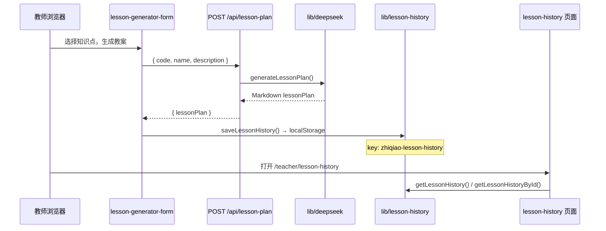
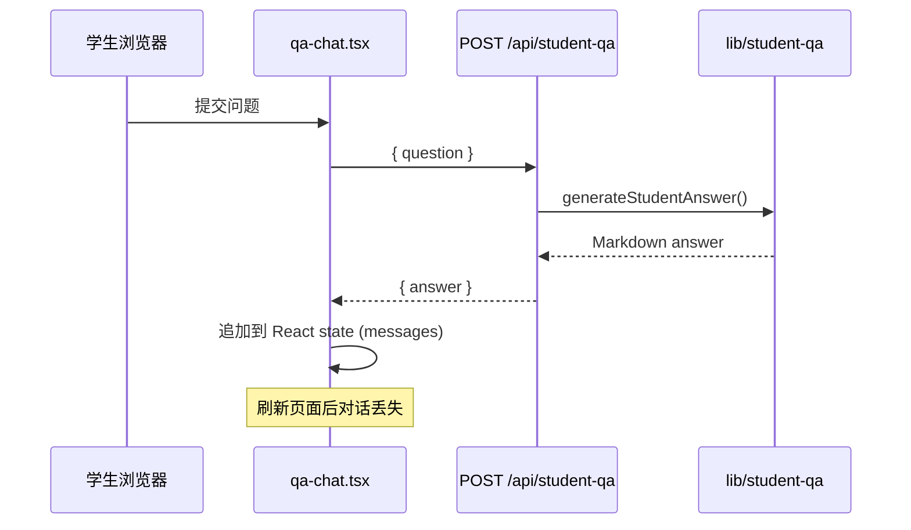
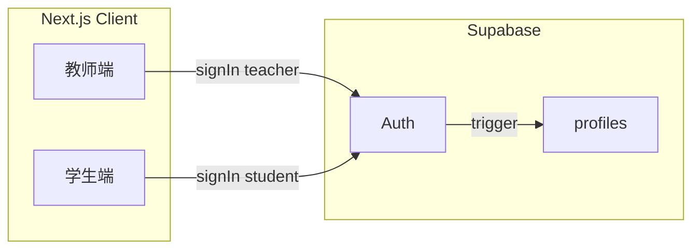
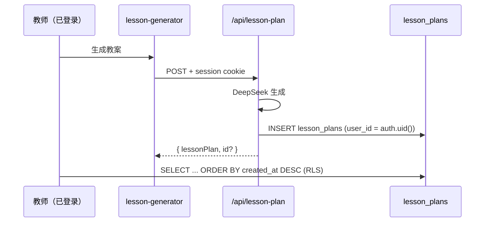
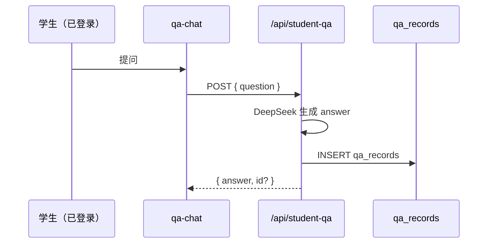

# 知桥 AI · Supabase 接入计划

> 本文档基于当前仓库代码与 `supabase/schema.sql`、`docs/database-schema.md` 的审阅结果编写。  
> **范围：** 规划 only，不包含实现改动。

## 1. 审阅摘要

### 1.1 `supabase/schema.sql`

| 表 | 用途 | 状态 |
|----|------|------|
| `profiles` | 用户档案，FK → `auth.users`，`user_role` 枚举 | 已定义，RLS 未启用 |
| `lesson_plans` | 教师教案历史 | 已定义，RLS 未启用 |
| `qa_records` | 学生答疑记录 | 已定义，RLS 未启用 |
| `knowledge_points` | 知识点主数据 | 已定义，RLS 未启用 |

- 已包含基础索引、CHECK 约束、`pgcrypto` / `gen_random_uuid()`。
- `handle_new_user` trigger 与 RLS policy 仅为注释模板，需在接入 Auth 后单独执行。
- **缺口：** 仓库内尚无 `@supabase/supabase-js`、种子数据 SQL、RLS 启用脚本。

### 1.2 `docs/database-schema.md`

- 与 `schema.sql` 一致，说明了 ER 关系与各表字段。
- 已标注当前应用仍用 `data/junior-math.ts` 与 `localStorage` 教案历史。
- 后续迁移清单与本文「实施顺序」对齐，可互为参考。

---

## 2. 当前存储与数据流

### 2.1 教案历史（Lesson History）

| 环节 | 实现 | 持久化 |
|------|------|--------|
| 生成 | `app/api/lesson-plan/route.ts` → `lib/deepseek.ts` | 无（仅当次响应） |
| 保存 | `lesson-generator-form.tsx` → `saveLessonHistory()` | **浏览器 localStorage** |
| 列表 | `lesson-history-list.tsx` → `getLessonHistory()` | 读 localStorage |
| 详情 | `lesson-history/[id]/page.tsx` → `getLessonHistoryById()` | 读 localStorage |

**字段映射（当前 → `lesson_plans`）：**

| localStorage (`LessonHistoryRecord`) | Supabase `lesson_plans` |
|-----------------------------------|-------------------------|
| `id` (string, 客户端生成) | `id` (uuid) |
| — | `user_id` (缺失，无登录) |
| `knowledgePointCode` | `knowledge_point_code` |
| `knowledgePointName` | `knowledge_point_name` |
| `content` | `content` |
| `createdAt` (ISO string) | `created_at` (timestamptz) |

### 2.2 学生答疑（Student QA）

| 环节 | 实现 | 持久化 |
|------|------|--------|
| 生成 | `app/api/student-qa/route.ts` → `lib/student-qa.ts` | 无 |
| 展示 | `app/student/qa/qa-chat.tsx` 内存 `messages` | **无**（未写 localStorage / DB） |

**目标表 `qa_records`：** 每轮问答一条记录（`question` + `answer` + `user_id` + `created_at`）。当前完全未对接。

### 2.3 知识库（Knowledge Base）

| 数据源 | 使用位置 |
|--------|----------|
| `data/junior-math.ts`（构建时静态 import） | `/teacher/knowledge-base`、`/teacher/lesson-generator` 级联选择 |

未使用 localStorage；迁移目标为 Supabase `knowledge_points` 表（可选分阶段，非阻塞 Auth）。

### 2.4 其他（非 Supabase 范围，供对照）

| 数据 | 位置 |
|------|------|
| DeepSeek 配置 | 服务端 `process.env`：`DEEPSEEK_*`（见 `.env.example`） |
| 教师/学生 UI Mock | `app/teacher/page.tsx` 等待办等硬编码 |

---

## 3. localStorage 使用清单

全仓库仅 **一处** 业务使用 localStorage：

| 文件 | Key | 操作 |
|------|-----|------|
| `lib/lesson-history.ts` | `zhiqiao-lesson-history` | `getItem` / `setItem` / `removeItem` |

**调用方（均在客户端组件）：**

| 文件 | 函数 |
|------|------|
| `app/teacher/lesson-generator/lesson-generator-form.tsx` | `saveLessonHistory`, `createLessonHistoryId` |
| `app/teacher/lesson-history/lesson-history-list.tsx` | `getLessonHistory` |
| `app/teacher/lesson-history/[id]/page.tsx` | `getLessonHistoryById` |

**说明：** `docs/database-schema.md` 中提到的 localStorage 即上述模块；无 `sessionStorage` / `IndexedDB`。

---

## 4. 目标 Supabase 流

### 4.1 认证与用户

- 教师、学生通过 Supabase Auth 登录（邮箱/魔法链接/OAuth 择一）。
- `handle_new_user` 根据 `raw_user_meta_data.role` 写入 `profiles`。
- 服务端 Route Handler 或 Server Action 使用 **用户 JWT**（`createServerClient`）或 **service role**（仅管理任务）访问数据库。

### 4.2 教案历史

- **写入：** 建议在 `POST /api/lesson-plan` 成功后在服务端 `INSERT`（与 DeepSeek 同事务逻辑），避免仅依赖客户端写入。
- **读取：** `/teacher/lesson-history` 通过 Server Component + Supabase client 或 `GET /api/lesson-plans` 拉取当前用户记录。

### 4.3 学生答疑

- 可选：保留当前会话 UI，同时将每轮 Q&A 持久化到 `qa_records`。
- 后续可增加 `/student/qa/history` 读取历史（V2）。

### 4.4 知识点目录

- 运维/脚本将 `data/junior-math.ts` 展平写入 `knowledge_points`。
- 教师端选择器改为查询 Supabase（可按 `subject, grade, semester, chapter` 筛选）。
- 所有已登录用户只读（RLS `SELECT` for `authenticated`）。

---

## 5. 环境变量

### 5.1 已有（DeepSeek，保持不变）

| 变量 | 用途 | 暴露 |
|------|------|------|
| `DEEPSEEK_API_KEY` | API 密钥 | 仅服务端 |
| `DEEPSEEK_BASE_URL` | 兼容端点 | 仅服务端 |
| `DEEPSEEK_MODEL` | 模型名 | 仅服务端 |

### 5.2 待新增（Supabase）

| 变量 | 用途 | 暴露 |
|------|------|------|
| `NEXT_PUBLIC_SUPABASE_URL` | 项目 URL | 客户端 + 服务端 |
| `NEXT_PUBLIC_SUPABASE_ANON_KEY` | 匿名公钥（配合 RLS） | 客户端 + 服务端 |
| `SUPABASE_SERVICE_ROLE_KEY` | 绕过 RLS（种子、管理） | **仅服务端**，禁止打包到客户端 |

可选：

| 变量 | 用途 |
|------|------|
| `SUPABASE_JWT_SECRET` | 仅在使用自定义 JWT 验证时需要（一般用 SDK 即可） |

**`.env.example` 更新：** 接入时补充上述 Supabase 三项及注释说明。

---

## 6. 迁移步骤

### 阶段 A：Supabase 项目就绪

1. 创建 Supabase 项目，在 SQL Editor 执行 `supabase/schema.sql`。
2. 在 Dashboard 启用 Auth Provider（至少一种登录方式）。
3. 取消注释并执行 `handle_new_user` trigger（或等价逻辑）。
4. 配置 `.env.local` 中 Supabase 环境变量。
5. 安装依赖：`@supabase/supabase-js`、`@supabase/ssr`（Next.js App Router 推荐）。

### 阶段 B：Auth 与 profiles

1. 新增 `lib/supabase/client.ts`、`lib/supabase/server.ts`（按官方 Next.js 15 模式）。
2. 教师/学生入口增加登录页或统一登录 + `role` 元数据。
3. 验证 `profiles` 行在注册后自动创建且 `role` 正确。
4. 编写并启用 `profiles` RLS policies。

### 阶段 C：教案历史 → `lesson_plans`

1. 启用 `lesson_plans` RLS（teacher + `user_id = auth.uid()`）。
2. 修改 `POST /api/lesson-plan`：认证校验 + `INSERT` into `lesson_plans`。
3. 新增 `GET /api/lesson-plans` 或 Server Component 直查列表/详情。
4. 重构 `lesson-history-list.tsx`、`[id]/page.tsx` 改为读 Supabase（移除对 `getLessonHistory` 的依赖）。
5. 从 `lesson-generator-form.tsx` 移除 `saveLessonHistory`（或保留为离线降级，默认关闭）。
6. **可选一次性迁移：** 提供客户端脚本，将 `localStorage` 中 `zhiqiao-lesson-history` 批量 POST 到 API（需已登录教师账号）。
7. 废弃 `lib/lesson-history.ts` 或改为仅 re-export Supabase 适配层。

### 阶段 D：学生答疑 → `qa_records`

1. 启用 `qa_records` RLS（student + `user_id = auth.uid()`）。
2. 修改 `POST /api/student-qa`：认证校验 + `INSERT` into `qa_records`。
3. `qa-chat.tsx` 无需 localStorage；会话仍可用内存 state，刷新后可从 DB 拉最近 N 条（可选）。
4. （可选）学生答疑历史页。

### 阶段 E：知识库 → `knowledge_points`

1. 编写 `supabase/seed-knowledge-points.sql` 或 Node 脚本，从 `data/junior-math.ts` 导入。
2. 启用 `knowledge_points` 只读 RLS。
3. 新增 `lib/knowledge-points.ts` 或 API 查询层级数据。
4. 逐步替换 `junior-math.ts` 在教案生成、知识库页的 import（可保留 TS 文件作 fallback 直至验收完成）。

### 阶段 F：收尾

1. 全量启用 RLS，删除 service role 在业务路径中的滥用。
2. 更新 `docs/database-schema.md` 中「当前为 localStorage」等描述。
3. E2E 测试：教师生成教案 → 历史列表 → 详情；学生提问 → DB 有记录。
4. 生产环境变量与 Supabase 项目备份策略。

---

## 7. 实施顺序（推荐）

| 顺序 | 项 | 理由 |
|------|-----|------|
| 1 | 执行 schema + 环境变量 + SDK 封装 | 基础设施 |
| 2 | Auth + `profiles` + RLS | 后续表均依赖 `user_id` |
| 3 | `lesson_plans` 接入 | 已有完整 UI，localStorage 迁移价值高 |
| 4 | `qa_records` 接入 | 改动面小（单 API + 可选历史 UI） |
| 5 | `knowledge_points` 种子 + 读接口 | 与 Auth 弱耦合，可并行但优先级略低 |
| 6 | localStorage 迁移工具 + 移除旧模块 | 避免双写期过长 |
| 7 | 文档与测试收尾 | — |

---

## 8. 风险与注意事项

| 风险 | 缓解 |
|------|------|
| 无登录即无法关联 `user_id` | 先上 Auth，再开 DB 写入 |
| localStorage 数据无法自动进云 | 提供一次性导入或告知用户重新生成 |
| RLS 配置错误导致数据泄露 | 先用测试项目验证 policy，禁止前端使用 service role |
| `lesson_plans.content` 体积大 | 单条 Markdown 通常可接受；超大内容再考虑对象存储 |
| 当前 API 无认证，上线前必须加 session 校验 | Route Handler 内 `supabase.auth.getUser()` |

---

## 9. 文件影响矩阵（实施时参考）

| 文件/目录 | 变更类型 |
|-----------|----------|
| `lib/supabase/*` | 新增 |
| `lib/lesson-history.ts` | 废弃或改为适配层 |
| `app/api/lesson-plan/route.ts` | 增加 Auth + INSERT |
| `app/api/student-qa/route.ts` | 增加 Auth + INSERT |
| `app/api/lesson-plans/route.ts` | 新增 GET（可选） |
| `app/teacher/lesson-generator/lesson-generator-form.tsx` | 移除 localStorage 保存 |
| `app/teacher/lesson-history/**` | 改为 Supabase 数据源 |
| `app/student/qa/qa-chat.tsx` | 可选持久化回调 |
| `data/junior-math.ts` | 逐步替换为 DB 查询 |
| `supabase/schema.sql` | 追加 RLS / trigger 正式版 |
| `supabase/seed-*.sql` | 新增 |
| `.env.example` | 补充 Supabase 变量 |
| `package.json` | 增加 `@supabase/supabase-js`、`@supabase/ssr` |

---

## 10. 相关文档

- [database-schema.md](./database-schema.md) — 表结构说明  
- [knowledge-base-design.md](./knowledge-base-design.md) — 知识点编码规则  
- [supabase/schema.sql](../supabase/schema.sql) — DDL 源文件  

---

*文档版本：V1 · 与仓库 commit 状态对齐（Supabase schema 已提交，应用侧未接 Supabase SDK）。*
